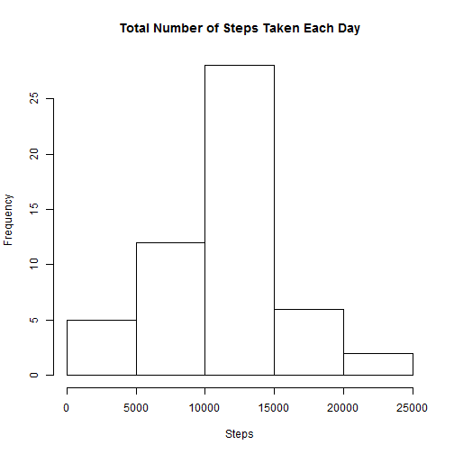
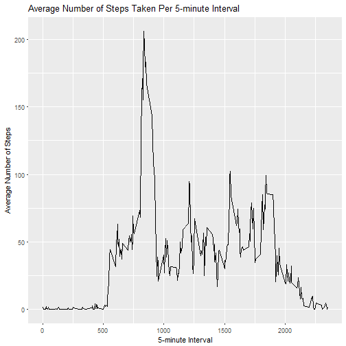
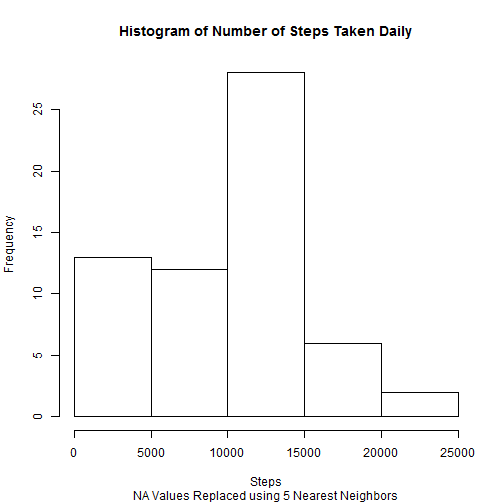
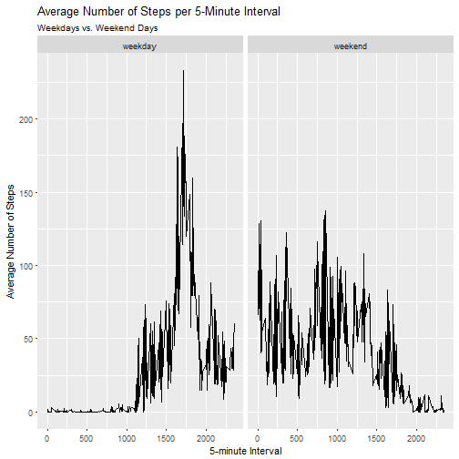

Peer-Graded Assignment 1, Reproducible Research
===============================================
### This assignment uses data from a single anonymous user of an activity tracker. The data contain three variables:
####-steps  
####-date  
####-interval  

###Steps measures the number of steps taken in the corresponding 5-minute interval and date. Missing values are represented as NA. This report reads the data, processes it where necessary, and presents various statistics and plots from the data. 

## 1. Code for reading in the dataset and/or processing the data
###The first step of this assignment is to read the data into R.

```r
tmp <- tempfile()
download.file("https://d396qusza40orc.cloudfront.net/repdata%2Fdata%2Factivity.zip", tmp)
activity_data <- read.csv(unzip(tmp, "activity.csv"))
unlink(tmp)
```
###The data look like this:

```
##   steps       date interval
## 1    NA 2012-10-01        0
## 2    NA 2012-10-01        5
## 3    NA 2012-10-01       10
## 4    NA 2012-10-01       15
## 5    NA 2012-10-01       20
## 6    NA 2012-10-01       25
```

## 2. Histogram of the total number of steps taken each day

```r
library(dplyr)
by_date <- group_by(activity_data, date)
total_by_date <- summarize(by_date, sum(steps))
hist(total_by_date$`sum(steps)`, xlab = "Steps", main = "Total Number of Steps Taken Each Day")
```



## 3. Mean and median number of steps taken each day

```r
options(scipen = 999)
ad_mean <- round(mean(total_by_date$`sum(steps)`, na.rm = TRUE), 2)
ad_median <- median(total_by_date$`sum(steps)`, na.rm = TRUE)
```

### Mean: 10766.19  
### Median: 10765

## 4. Time series plot of average number of steps taken

```r
library(lubridate)
library(ggplot2)
by_interval <- group_by(activity_data, interval)
total_by_interval <- summarize(by_interval, mean(steps, na.rm = TRUE))

ggplot(total_by_interval, aes(interval, total_by_interval$`mean(steps, na.rm = TRUE)`)) + geom_line() + labs(x = "5-minute Interval", y = "Average Number of Steps", title = "Average Number of Steps Taken Per 5-minute Interval")
```



## 5. The 5-minute interval that, on average, contains the maximum number of steps.

```r
sorted_intervals <- arrange(total_by_interval, desc(`mean(steps, na.rm = TRUE)`))
top_int <- sorted_intervals[1,1]
```

###The 5-minute interval that, on average, contains the maximum number of steps is: **835**

## 6. Code to describe and show a strategy for inputing missing data.

First we determine the number of missing values:

```r
missing <- sum(is.na(activity_data))
```

### Thus, we find that this data set has 2304 missing values.

### Here I have chosen to use the kNN (k nearest neighbor) to replace the missing values in the step column. The function identifies the k (here using the default, k = 5) closest neighbors to the missing value in question using the other available data. So in this case, if a step value is missing at interval 100 for a particular date, this function takes the mean of the five closest step values at interval 100 (i.e., the five closest dates for which values are available) and imputes the value.


```r
library(VIM)
ad3 <- kNN(activity_data)
by_date2 <- group_by(ad3, date) ## uses Nearest Neighbor imputation from VIM package to replace missing values.
total_by_date2 <- summarize(by_date2, sum(steps))
by_interval2 <- group_by(ad3, interval)
total_by_interval2 <- summarize(by_interval2, mean(steps, na.rm = TRUE))
```

## 7. Histogram of the total number of steps taken each day after missing values are imputed


```r
hist(total_by_date2$`sum(steps)`, xlab = "Steps", main = "Histogram of Number of Steps Taken Daily", sub = "NA Values Replaced using 5 Nearest Neighbors")
```



## 8. Panel plot comparing the average number of steps taken per 5-minute interval across weekdays and weekends


```r
ad4 <- mutate(ad3, day = wday(date))
ad4$day[ad4$day == 1 | ad4$day == 7] <- "weekend"
ad4$day[ad4$day > 1 & ad4$day < 7] <- "weekday"
by_interval3 <- group_by(ad4, interval, day)
total_by_interval3 <- summarize(by_interval3, mean(steps))
ggplot(total_by_interval3, aes(interval, total_by_interval3$`mean(steps)`)) + geom_line() + facet_grid(.~day) + labs(x = "5-minute Interval", y = "Average Number of Steps", title = "Average Number of Steps per 5-Minute Interval", subtitle = "Weekdays vs. Weekend Days")
```



